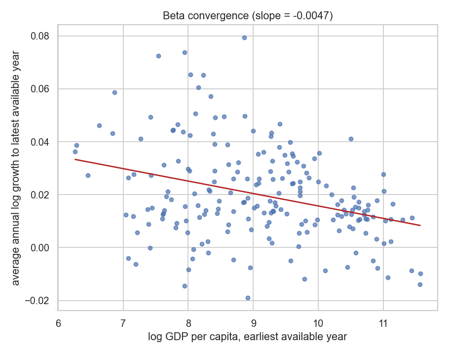
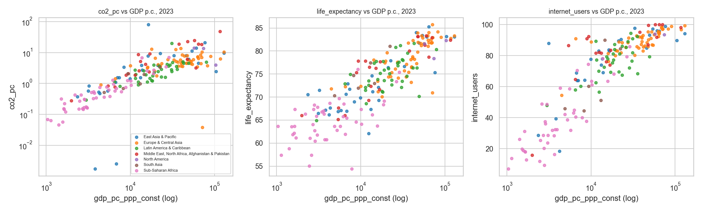
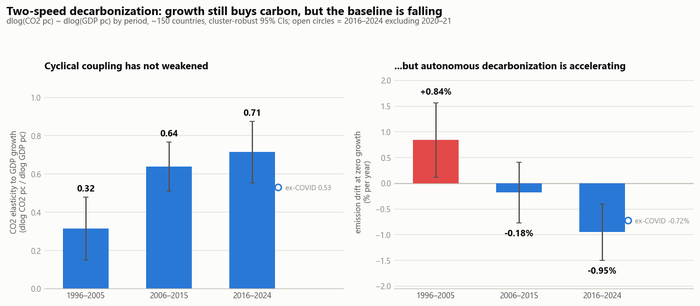

# World Panel → EKC Project — Final Summary

**From raw World Bank API calls to a stakeholder-defended econometric finding.**
Country-year panel, ~150–217 economies, 1995–2024. Every claim below is
observational (no instruments anywhere); every number is reproducible from the
pipeline and verified against its source CSV.

---

## 1. Project overview & reproduction map

The project is four runnable stages. Each stage reads only the previous
stage's outputs, so the whole thing rebuilds from scratch in order:

| Stage | Script | Produces | Purpose |
|---|---|---|---|
| 1. Data | [notebooks/build_panel.py](notebooks/build_panel.py) | `output/panel_*.csv/.parquet`, coverage/availability/meta CSVs | Fetch, clean, audit, and feature-engineer the panel |
| 2. EDA | [notebooks/eda.py](notebooks/eda.py) | `output/eda/` — 13 figures/tables + `eda_report.md` | Understand coverage, distributions, relationships |
| 3a. Topic scan | [notebooks/topic_models.py](notebooks/topic_models.py) | `output/models/` — 9 artifacts + `topic_models_report.md` | Four candidate econometric topics, panel FE regressions |
| 3b. Deep model | [notebooks/run_ekc_pipeline.py](notebooks/run_ekc_pipeline.py) + [notebooks/ekc_pipeline/](notebooks/ekc_pipeline) | `output/ekc/` — 26 artifacts + `EKC_REPORT.md` | The chosen topic built to production rigor |
| 4. Defense | [notebooks/stakeholder_stress_tests.py](notebooks/stakeholder_stress_tests.py) | `output/ekc/stress/` — 7 artifacts + `STAKEHOLDER_BRIEF.md` | Stress tests, objection Q&A, star result |

```
pip install requests pandas numpy matplotlib seaborn tabulate statsmodels linearmodels scikit-learn
cd notebooks
python build_panel.py && python eda.py && python topic_models.py
python run_ekc_pipeline.py && python stakeholder_stress_tests.py
```

63 output artifacts total. Raw API responses are cached under `notebooks/cache/`
so re-runs don't re-hit the World Bank API.

---

## 2. Data creation & engineering

### The panel
**38 indicators × 217 economies × 1995–2024** (6,510 country-year rows), all
from the World Bank API (WDI + WGI), fetched into a long
`(iso3, year, indicator, value)` table and pivoted wide. Indicator families:
economy (GDP PPP, growth, unemployment, investment, savings), governance (6
WGI estimates), trade & FDI, inequality & poverty (Gini, $2.15 poverty),
human capital & demographics (enrollment, fertility, dependency, health, R&D),
innovation/AI proxies (internet, high-tech exports, patents, ICT services),
and energy & pollution (CO2 pc/total, PM2.5, renewables, energy intensity,
fossil share, electricity & clean-cooking access).

Engineered features for modeling (`panel_model_ready.csv`): `log_gdp_pc`,
`log_population`, `log_co2_pc`, panel-consistent growth (`gdp_pc_growth_calc`,
r = 0.96 with the WB's own series — an internal consistency check), a 1-year
GDP lag, carbon intensity (`co2_per_1000gdp`), and a linear trend.

### What broke and got fixed during the build
- The bare WGI codes (`CC.EST` …) are **retired** — the API now serves them as
  `GOV_WGI_*`. Total CO2 (`EN.ATM.CO2E.KT`) is archived → swapped to
  `EN.GHG.CO2.MT.CE.AR5`; clean-cooking code corrected to `EG.CFT.ACCS.ZS`.
- Firing ~35 requests back-to-back triggered spurious 400s → per-indicator
  throttling added.

### The data audit (what a modeler needs to know)
- **`sanity_clip`**: dropped 6 physically impossible negative
  `fossil_fuel_pct` values (a WB series-transition artifact — LTU −61%!) and 3
  single-year life-expectancy glitches (CAF at 14.7 years flanked by ~48).
  Verified first that other negative values (gross savings, capital formation)
  are *real economics* (São Tomé dissaving, Sierra Leone 1997) and kept them.
- **`is_micro_state` flag** (pop < 1M, 57 of 217 entities): kept in the data,
  excluded from all modeling — they drive implausible per-capita values
  (Micronesia at 0.002 t CO2 pc) and coverage noise.
- **The selection-bias trap**: complete-case on all 38 indicators yields only
  **75 countries — 40 high-income vs 1 low-income**. Dropping the 7
  structurally sparse indicators and micro-states gives the honest modeling
  core: **120 countries, 2000–2022**.

---

## 3. EDA — what the data says and how much to trust it

Full report: [notebooks/output/eda/eda_report.md](notebooks/output/eda/eda_report.md)

- **Coverage structure matters more than averages**: WGI is *structurally*
  missing 1997/1999/2001 (biennial survey pre-2002 — don't interpolate across
  it); Gini and R&D never reach 50% single-year coverage (usable pooled, never
  as a cross-section); `energy_use_pc` dies ~2014.
- **Reality checks passed**: unconditional beta-convergence slope **−0.0047**
  (poorer countries grew faster); governance–GDP correlations match the
  institutions literature (gov. effectiveness 0.83, control of corruption
  0.72); top movers are textbook history (Guyana +897% oil boom, China +749%,
  Syria −40% civil war).
- **Process fix worth remembering**: the original snapshot-year picker checked
  3 hardcoded columns and silently blanked 6 indicators in every plot; the fix
  (`pick_snapshot_year`) requires ≥90% of *all* indicators to clear the
  coverage bar. The 38×38 correlation grid was split into 3 legible thematic
  heatmaps.




---

## 4. Topic exploration & model choice

Four candidate topics were run as proper panel FE regressions
([notebooks/output/models/topic_models_report.md](notebooks/output/models/topic_models_report.md)):

| Topic | Headline result | Verdict |
|---|---|---|
| Tech diffusion → growth (AI proxy) | Internet penetration **not significant** (p=0.46) once FE + trade controls in; honest null | Interesting but a null |
| **Pollution: EKC × governance + decoupling** | Governance bends the pooled curve (p=0.008); decoupling −2%/yr in high/upper-mid income | **Chosen** |
| Conditional beta-convergence | −0.051*** on lagged log GDP (Nickell bias flagged) | Solid, textbook |
| Digital divide & inequality | Gini −1.07***; access dispersion peaked 2013, now narrowing | Descriptive story |

**Why EKC won**: 2026-relevant (climate/decoupling), and a grounding check
found the pooled GDP–CO2 quadratic is **U-shaped, not inverted-U** — dominated
by petrostates (Qatar 45.9 t/capita) — meaning the textbook result was
*fragile*, which is a far richer story than confirming a null or a textbook
plot. Along the way a real bug was caught: year fixed effects had absorbed the
linear trend in the decoupling regression, producing spurious positive
coefficients (fixed: entity-FE only for trend regressions).

---

## 5. The model — EKC pipeline (`notebooks/ekc_pipeline/`)

A modular package: `config → data → models → diagnostics → turning_point →
validation → report`. Core design choices, each justified by a test:

### Specification ladder — the headline inferential result
The sign of the squared-income term **is not stable** (income polynomial
mean-centered; VIF fell 373 → 7.2 with coefficients unchanged):

| Spec | b(log GDP²) | p | SEs |
|---|---|---|---|
| 1. Pooled quadratic ("textbook EKC") | **+1.324***\* | 0.001 | clustered |
| 2. + country FE | −0.122 | 0.22 | Driscoll-Kraay |
| 3. + year FE (two-way) | −0.034 | 0.72 | Driscoll-Kraay |
| 4. + controls | **+0.478***\* | <0.001 | Driscoll-Kraay |
| 5. + governance interaction | **+0.503***\* | <0.001 | Driscoll-Kraay |

No specification produces the inverted-U. The **block bootstrap** (500
country-resamples) puts an interior turning point in only **2.2%** of fits
(0% with controls) — the EKC peak is unidentified. Only 3.2% of CO2-pc
variance is within-country, which is *why* the pooled curve misleads.

- **Estimator choice tested, not assumed**: Mundlak joint Wald 23.85
  (p=0.001) ⇒ FE required (classic Hausman degenerates, reported as such);
  Wooldridge AR(1) ρ=0.76 and Pesaran CD=4.78 (both p<0.001) ⇒ Driscoll-Kraay
  SEs, with clustered SEs shown side-by-side (identical point estimates).
- **Governance moderation is between-country only**: pooled interaction
  −1.18* vs within-country −0.05 (p=0.67).
- **Robustness battery**: petrostate exclusion, 2 alternative DVs, subperiods,
  alternative moderator — the no-inverted-U conclusion survives all of them.


---

## 6. Tuning & validation — where honesty got enforced

Temporal holdout: train ≤2018, test 2019–2024, every model scored on the same
391 rows. GBM hyperparameters chosen on an **inner temporal fold** (≤2014 fit,
2015–18 score; selected: 400 trees, lr 0.1, depth 2); importances are held-out
**permutation** importances, not impurity.

**Task 1 — levels (a persistence check, not a model win):**

| Model | RMSE | R² |
|---|---|---|
| Naive persistence (carry last value) | **0.901** | **0.977** |
| Structural country-FE OLS | 1.008 | 0.971 |
| Tuned gradient boosting | 1.097 | 0.966 |

CO2 pc is a near-random-walk (autocorr 0.996): the naive baseline **beats both
models**, so a high level-R² reflects persistence, not skill.

**Task 2 — changes (where models earn their keep):**

| Model | RMSE | R² |
|---|---|---|
| Naive (zero change) | 0.645 | −0.005 |
| **Structural differenced OLS** | **0.581** | **0.184** |
| Gradient boosting (differences) | 0.606 | 0.115 |

On the genuinely hard task, the parsimonious structural model **beats the
black box** — with ΔGDP as the dominant driver.


---

## 7. Review & defense — bugs caught, objections pre-answered

### What the peer review caught (and fixed)
1. **The original validation over-claimed**: it reported the level-task R²≈0.97
   as a model win with no baseline — the naive check unmasked it.
2. **Different-test-set comparison** between the two models (latent bug).
3. **Intercept-zeroing reindex bug** that had made the structural model look
   catastrophic (R²=−31) before the constant-alignment fix (→ 0.971).
4. Unfair GBM (hand-fed the quadratic; impurity importances), uncentered
   polynomial (VIF ~370), degenerate Hausman as sole FE evidence — all fixed.

### Stress tests ([STAKEHOLDER_BRIEF.md](notebooks/output/ekc/STAKEHOLDER_BRIEF.md) has the full 8-question Q&A)
- **"Your change-task win is just COVID"** — largely yes, and that *is* the
  finding: ex-COVID R²≈0.015 (calm-year changes are near-noise) vs 0.267 in
  2020–21, when naive persistence collapsed to −0.45. The model earns its keep
  exactly when growth moves.
- **"Same-year drivers aren't a forecast"** — conceded with numbers: lagged
  info only gives R²=0.01. The model is **attribution**, not prophecy.
- **"Petrostates create your U-shape"** — they amplify, not create: +0.65***
  without all 8.
- **"Intensity decoupling is a ratio trick"** — absolute per-capita emissions
  are genuinely falling in high income (**−0.070 t/yr***, p<0.001) but still
  **rising** in upper-middle income (+0.038 t/yr, p<0.01).
- Power, small-T/Driscoll-Kraay, and causality objections each answered with
  the specific artifact that addresses them.

---

## 8. Final findings — two-speed decarbonization

The closing analysis regressed Δlog(CO2 pc) on Δlog(GDP pc) per period. The
intercept is the **autonomous drift** (emission change at zero growth); the
slope is the **cyclical coupling** (elasticity to growth). They moved in
opposite directions — both shifts significant (Δelasticity +0.40, p<0.001;
Δdrift −1.78 pp/yr, p<0.001):

| Period | Cyclical coupling (elasticity) | Autonomous drift (%/yr) |
|---|---|---|
| 1996–2005 | 0.32*** | **+0.84** |
| 2006–2015 | 0.64*** | −0.18 |
| 2016–2024 | 0.72*** (0.53 ex-COVID) | **−0.95** (−0.72 ex-COVID) |

High-income countries ex-COVID: drift **−2.7%/yr**, coupling still ~0.53.



**The thesis, in one paragraph.** The Environmental Kuznets Curve — the
promise that growth eventually cleans up after itself — is not in this data:
its inverted-U is a cross-sectional artifact that flips sign under
within-country fixed effects and never yields an identified turning point.
What is in the data is two-speed decarbonization: each 1% of GDP growth still
brings ~0.5–0.7% more CO2 — *tighter* coupling than in the 1990s — while the
zero-growth baseline has swung from +0.8%/yr to −1%/yr globally (−2.7%/yr in
rich countries). **Decarbonization is happening around growth — via the energy
mix and technology — not through it.** Waiting for an income turning point is
not a strategy; the drift is where the policy leverage lies.

### Limitations (stated, not buried)
- Observational throughout; no instrument exists here — associations, not
  causal effects. Reverse causality and omitted variables (energy prices,
  industrial structure) unaddressed.
- The convergence spec carries Nickell bias (flagged; Arellano-Bond not
  attempted). Turning points from quadratics are functional-form sensitive.
- WGI's 1997/99/01 structural gap; post-2021 control coverage lags (change-task
  test years 2022+ have n≤7).
- Intensity decoupling ≠ sufficiency: absolute emissions still rise wherever
  GDP outruns the drift. Results describe the ~150 larger economies.

### If this continued
Arellano-Bond/GMM for the dynamic specs; sectoral emissions (power vs
transport vs industry) to decompose *which* mix changes drive the drift;
event-study designs around carbon-pricing adoptions for a shot at
identification; and true AI-investment data (OECD.AI) if global coverage ever
materializes — the internet-diffusion proxy question from stage 3 deserves a
better instrument than WDI can offer.

---

*Produced across one working session: 5 pipeline stages, 63 verified
artifacts, 3 self-caught analytical bugs, and one thesis that survived its own
red team.*
