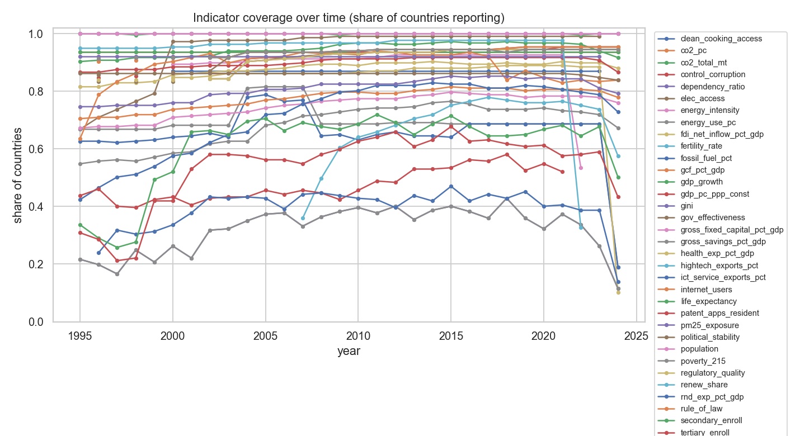
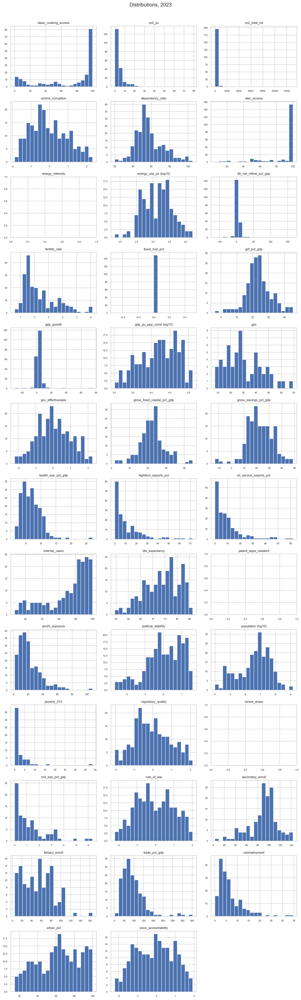
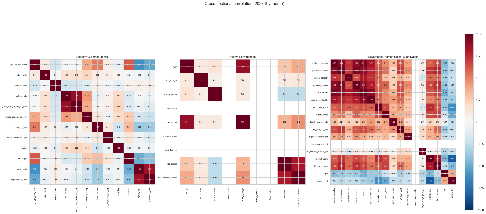
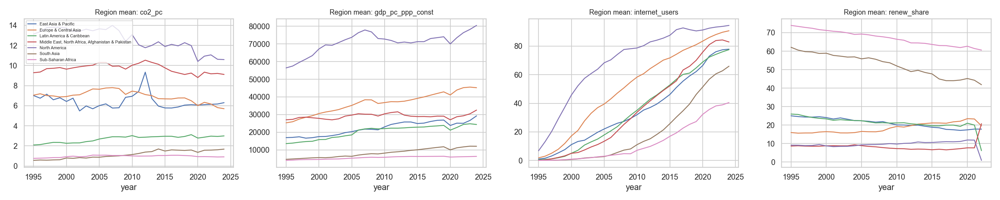
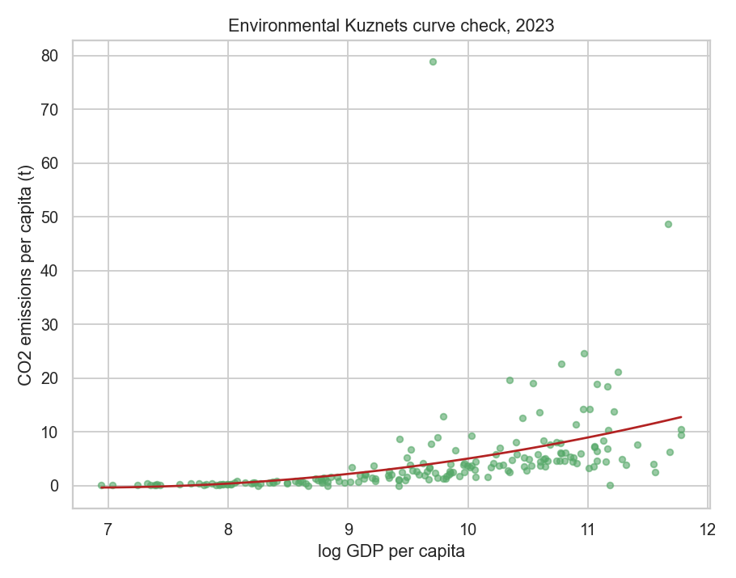

# World panel — EDA report

- Countries (N): **217**
- Years: **1995–2024**
- Indicators: **38**
- Cross-sectional snapshot year (best coverage): **2023**
- Panel structure (T = years observed per country): min **30**, median **30**, max **30** (balanced panel)

## Coverage

Missing share by indicator (whole panel):

| indicator                   |   missing_share |
|:----------------------------|----------------:|
| poverty_215                 |     0.680031    |
| gini                        |     0.680031    |
| rnd_exp_pct_gdp             |     0.621045    |
| hightech_exports_pct        |     0.59063     |
| patent_apps_resident        |     0.573425    |
| tertiary_enroll             |     0.463134    |
| secondary_enroll            |     0.393702    |
| fossil_fuel_pct             |     0.344547    |
| gross_savings_pct_gdp       |     0.318894    |
| energy_use_pc               |     0.316129    |
| energy_intensity            |     0.310906    |
| clean_cooking_access        |     0.303226    |
| health_exp_pct_gdp          |     0.299232    |
| ict_service_exports_pct     |     0.285868    |
| gross_fixed_capital_pct_gdp |     0.250077    |
| gcf_pct_gdp                 |     0.224885    |
| gov_effectiveness           |     0.206144    |
| regulatory_quality          |     0.205991    |
| control_corruption          |     0.201075    |
| political_stability         |     0.19278     |
| trade_pct_gdp               |     0.191551    |
| voice_accountability        |     0.188172    |
| rule_of_law                 |     0.186482    |
| unemployment                |     0.139631    |
| fdi_net_inflow_pct_gdp      |     0.122427    |
| renew_share                 |     0.119508    |
| internet_users              |     0.115054    |
| pm25_exposure               |     0.109063    |
| gdp_pc_ppp_const            |     0.100614    |
| elec_access                 |     0.0887865   |
| co2_pc                      |     0.0645161   |
| co2_total_mt                |     0.0645161   |
| gdp_growth                  |     0.0545315   |
| life_expectancy             |     0.000460829 |
| dependency_ratio            |     0           |
| fertility_rate              |     0           |
| population                  |     0           |
| urban_pct                   |     0           |

## Distributions

## Correlations

Strongest (anti)correlations with GDP per capita in 2023:

|                             |   corr_with_gdp_pc |
|:----------------------------|-------------------:|
| fertility_rate              |              -0.61 |
| dependency_ratio            |              -0.51 |
| poverty_215                 |              -0.4  |
| gini                        |              -0.37 |
| pm25_exposure               |              -0.2  |
| unemployment                |              -0.19 |
| population                  |              -0.06 |
| gcf_pct_gdp                 |              -0.02 |
| gross_fixed_capital_pct_gdp |               0    |
| co2_total_mt                |               0.05 |
| fdi_net_inflow_pct_gdp      |               0.07 |
| ict_service_exports_pct     |               0.08 |
| gdp_growth                  |               0.09 |
| health_exp_pct_gdp          |               0.17 |
| gross_savings_pct_gdp       |               0.38 |
| co2_pc                      |               0.41 |
| hightech_exports_pct        |               0.44 |
| elec_access                 |               0.46 |
| secondary_enroll            |               0.48 |
| tertiary_enroll             |               0.5  |
| political_stability         |               0.51 |
| rnd_exp_pct_gdp             |               0.52 |
| trade_pct_gdp               |               0.52 |
| voice_accountability        |               0.53 |
| urban_pct                   |               0.61 |
| clean_cooking_access        |               0.62 |
| internet_users              |               0.67 |
| energy_use_pc               |               0.67 |
| rule_of_law                 |               0.7  |
| control_corruption          |               0.74 |
| life_expectancy             |               0.75 |
| regulatory_quality          |               0.81 |
| gov_effectiveness           |               0.82 |
| energy_intensity            |             nan    |
| fossil_fuel_pct             |             nan    |
| patent_apps_resident        |             nan    |
| renew_share                 |             nan    |

## Key relationships

## Regional trends

## Beta convergence

OLS slope of avg. growth on initial log GDP p.c.: **-0.0047** -> convergence (poorer countries grew faster).

## Environmental Kuznets curve check

No inverted-U turning point detected within the observed GDP range in 2023 (or insufficient data).

## Governance vs. GDP per capita

Correlation of WGI governance estimates with log GDP p.c. in 2023:

|                      |   corr_with_log_gdp_pc |
|:---------------------|-----------------------:|
| gov_effectiveness    |                   0.84 |
| regulatory_quality   |                   0.8  |
| control_corruption   |                   0.71 |
| rule_of_law          |                   0.7  |
| political_stability  |                   0.59 |
| voice_accountability |                   0.55 |

## Interesting facts: biggest movers

Largest total % change from each country's first to last available observation (min. 5-year span):

| indicator        | iso3   |   pct_change |
|:-----------------|:-------|-------------:|
| gdp_pc_ppp_const | GUY    |        897.2 |
| gdp_pc_ppp_const | CHN    |        749.2 |
| gdp_pc_ppp_const | GNQ    |        716.8 |
| gdp_pc_ppp_const | BIH    |        564.2 |
| gdp_pc_ppp_const | GEO    |        561.3 |
| gdp_pc_ppp_const | SYR    |        -40.1 |
| gdp_pc_ppp_const | SDN    |        -34.1 |
| gdp_pc_ppp_const | ARE    |        -33.3 |
| gdp_pc_ppp_const | LBY    |        -29   |
| gdp_pc_ppp_const | KWT    |        -28   |
| co2_pc           | GRL    |      48505.9 |
| co2_pc           | LAO    |       4107.4 |
| co2_pc           | TCA    |       1382.1 |
| co2_pc           | VNM    |        794.2 |
| co2_pc           | MLI    |        747.5 |
| co2_pc           | UKR    |        -65.2 |
| co2_pc           | DNK    |        -63   |
| co2_pc           | YEM    |        -60.9 |
| co2_pc           | GAB    |        -59.4 |
| co2_pc           | GBR    |        -55.3 |

## Caveats

- Cross-sectional correlations are **pooled** and confound between-country and within-country variation; treat as descriptive only, not causal.
- Coverage is uneven: indicators with high missing share (see table) will shrink any complete-case model window.
- `energy_use_pc` (World Bank) effectively ends ~2014.
- WGI governance indicators (`control_corruption`, `gov_effectiveness`, `political_stability`, `regulatory_quality`, `rule_of_law`, `voice_accountability`) are **structurally missing**, not randomly missing, for 1997/1999/2001 -- the survey was biennial before 2002. Don't naively interpolate or use year fixed effects across that gap without accounting for it.
- `gini` and `rnd_exp_pct_gdp` never reach ~50% cross-sectional coverage in *any* single year (survey-based, irregular timing) -- usable pooled across years, not as a single-year cross-section.
- Micro-states/territories (population < 1,000,000, flagged via `is_micro_state` in the panel) disproportionately drive missingness and occasional implausible values in per-capita indicators; consider filtering them out (`df[~df.is_micro_state]`) for cross-country regressions.