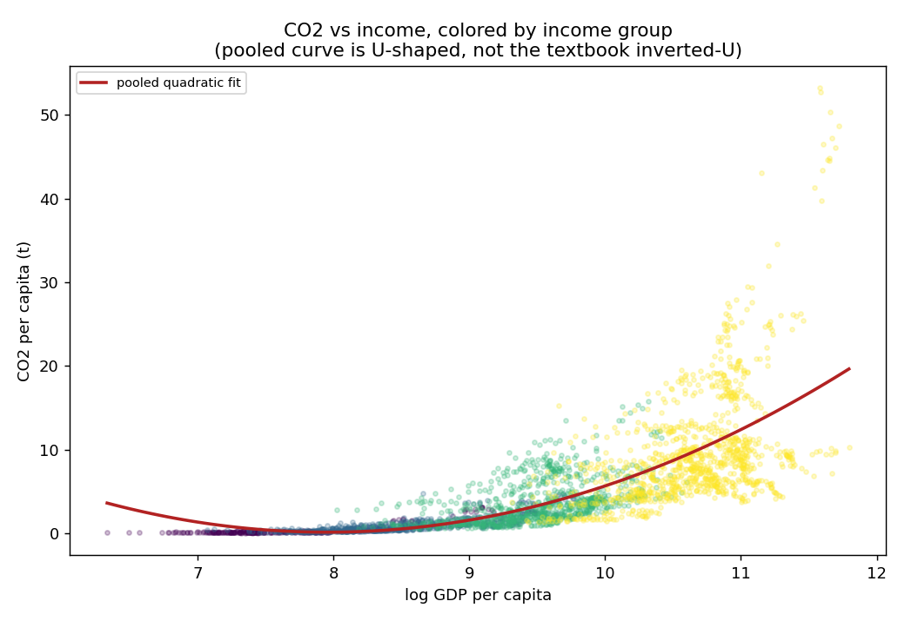
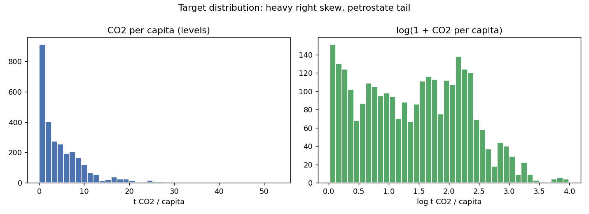
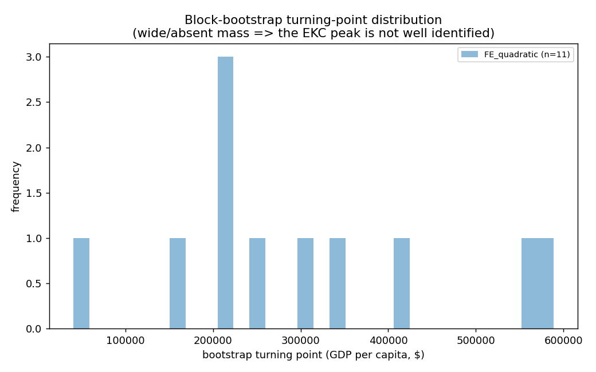
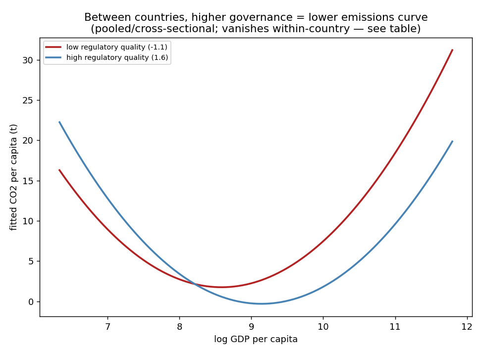
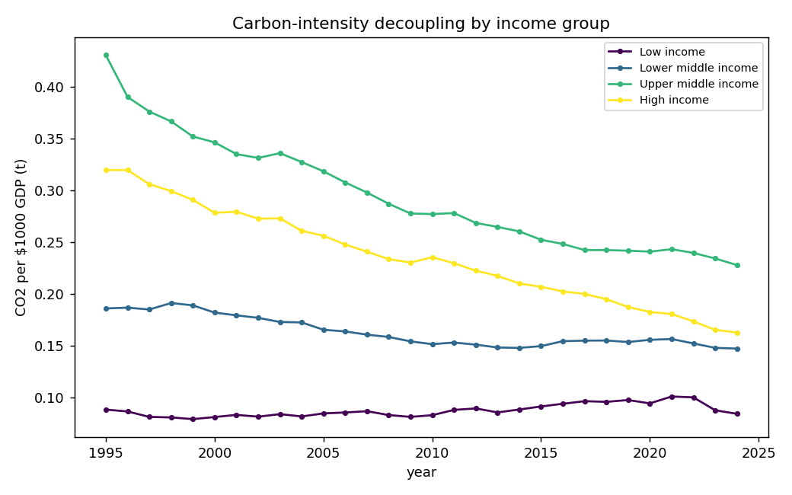
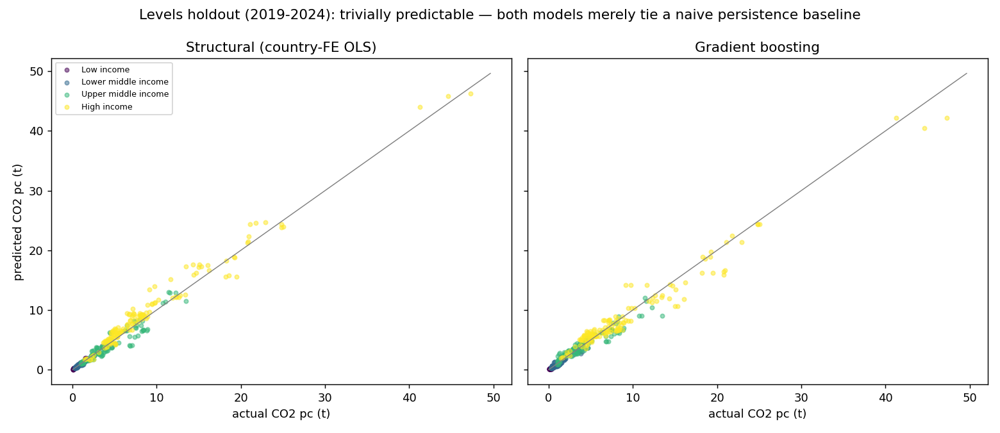
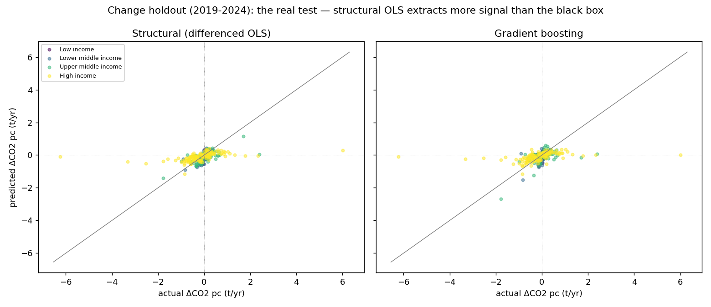
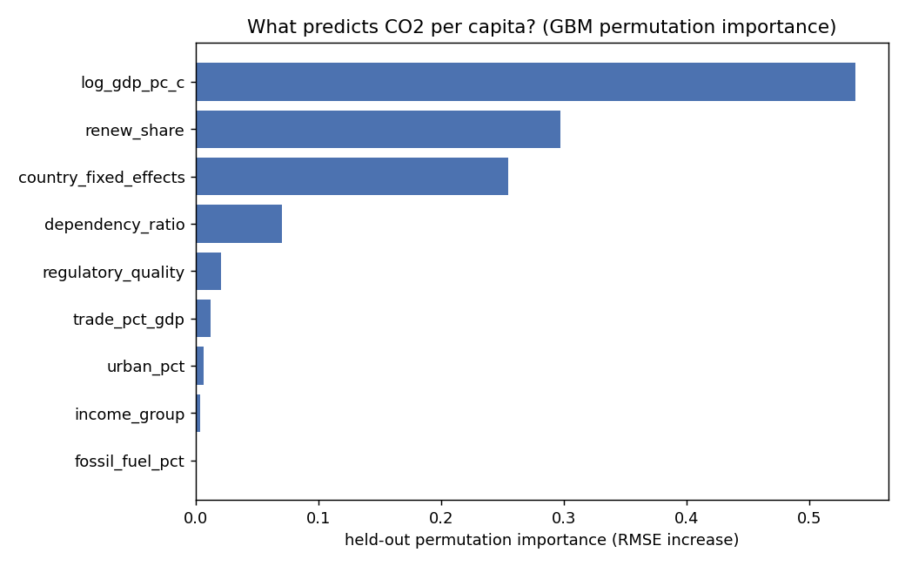

# Does growth have to cost the planet?

## Environmental Kuznets Curve, governance, and carbon decoupling — a panel study

*Country-year panel, ~150 countries, 1996–2024. All estimates are observational associations, not causal effects.*

## Research questions & hypotheses

- **H1 (EKC):** does CO2 per capita follow an inverted-U in income — rising, then falling past a turning point?
- **H2 (governance):** does regulatory quality shift/flatten that relationship?
- **H3 (decoupling):** are countries cutting carbon intensity within their own borders over time, and does the pace depend on income level?

## Headline finding: the textbook EKC is fragile

The specification ladder below walks from the naive pooled quadratic to two-way fixed effects with controls. **The sign of the squared-income term is not stable** — the textbook inverted-U is an artifact of comparing rich and poor countries cross-sectionally (and of petrostate outliers), not a robust within-country law.

*Note: the income polynomial is mean-centered, so the linear coefficient is the slope at mean income and the linear/quadratic terms are not collinear (VIF ~7/1.5, not ~370). Centering leaves the squared-term coefficient — and this sign-flip finding — unchanged; it only makes the coefficients interpretable. `se_type` gives the standard-error family per row.*

| spec                   | se_type        |   n_obs |   rsq_within | log_gdp_pc_c   |   log_gdp_pc_c_p | log_gdp_pc_c_sq   |   log_gdp_pc_c_sq_p |   regulatory_quality |   regulatory_quality_p |   log_gdp_pc_x_gov |   log_gdp_pc_x_gov_p |
|:-----------------------|:---------------|--------:|-------------:|:---------------|-----------------:|:------------------|--------------------:|---------------------:|-----------------------:|-------------------:|---------------------:|
| 1_pooled_quadratic     | clustered      |    2843 |      nan     | 3.642***       |                0 | 1.324***          |               0.001 |                      |                nan     |                    |              nan     |
| 2_entity_FE            | Driscoll-Kraay |    2843 |        0.056 | 0.964***       |                0 | -0.122            |               0.224 |                      |                nan     |                    |              nan     |
| 3_twoway_FE            | Driscoll-Kraay |    2843 |       -0.116 | 2.757***       |                0 | -0.034            |               0.719 |                      |                nan     |                    |              nan     |
| 4_twoway_FE_controls   | Driscoll-Kraay |    2843 |       -0.064 | 2.417***       |                0 | 0.478***          |               0     |                      |                nan     |                    |              nan     |
| 5_twoway_FE_governance | Driscoll-Kraay |    2843 |       -0.061 | 2.366***       |                0 | 0.503***          |               0     |                0.071 |                  0.571 |             -0.049 |                0.668 |

## Turning point: is there even a peak?

For each FE quadratic we estimate the implied turning point and a **country block-bootstrap** 95% CI. `inverted_u_boot_share` is the fraction of bootstrap resamples that produced an inverted-U at all — low values mean the peak is not identified.

| spec                  |   b_gdp_sq |   gdp_sq_p |   turning_point_usd |   ci_lo_usd |   ci_hi_usd |   inverted_u_boot_share |   gdp_range_lo |   gdp_range_hi | tp_in_sample   |
|:----------------------|-----------:|-----------:|--------------------:|------------:|------------:|------------------------:|---------------:|---------------:|:---------------|
| FE_quadratic          |    -0.0337 |     0.3966 |                 nan |       71000 |      583954 |                   0.022 |            563 |         132617 | False          |
| FE_quadratic_controls |     0.4775 |     0      |                 nan |         nan |         nan |                   0     |            563 |         132617 | False          |

## H2: governance moderation is a *between-country* pattern

The `log_gdp_pc × regulatory_quality` interaction is strongly negative in the pooled (between-country) specification — higher-governance countries sit on a lower emissions-income curve — but it **collapses to near-zero and insignificant once country fixed effects are added**. Governance moderation is a cross-country stylized fact, not a within-country lever, the same fragility theme as the EKC shape itself.

| model                         |   n_obs | gdp_x_gov_coef   |   gdp_x_gov_p |
|:------------------------------|--------:|:-----------------|--------------:|
| pooled_between (year FE only) |    2843 | -1.181*          |        0.0545 |
| twoway_FE (within-country)    |    2843 | -0.049           |        0.6678 |

## H3: decoupling is real but income-conditional

Within-country trend in carbon intensity (CO2 per $1000 GDP), by income group. Negative = decoupling.

| income_group        |   n_obs |   trend_coef |   p_value |   pct_per_year |
|:--------------------|--------:|-------------:|----------:|---------------:|
| Low income          |     622 |      0.00066 |    0.1255 |          0.754 |
| Lower middle income |    1151 |     -0.00143 |    0.3144 |         -0.875 |
| Upper middle income |    1230 |     -0.0059  |    0.0001 |         -2.003 |
| High income         |    1500 |     -0.00524 |    0      |         -2.219 |

### EKC curvature by income group

| income_group        |   n_obs |   b_gdp |   b_gdp_sq |   gdp_sq_p |   turning_point_usd_pt |
|:--------------------|--------:|--------:|-----------:|-----------:|-----------------------:|
| Low income          |     253 |   2.432 |      0.538 |      0     |                    nan |
| Lower middle income |     677 |   1.349 |      0.328 |      0     |                    nan |
| Upper middle income |     857 |   2.518 |      0.386 |      0.012 |                    nan |
| High income         |    1056 |   4.751 |     -0.214 |      0.565 |                    nan |

### EKC curvature by region

| region                                            |   n_obs |   b_gdp_sq |   gdp_sq_p |   turning_point_usd_pt |
|:--------------------------------------------------|--------:|-----------:|-----------:|-----------------------:|
| East Asia & Pacific                               |     334 |      0.359 |      0     |                    nan |
| Europe & Central Asia                             |     974 |     -0.065 |      0.704 |                    nan |
| Latin America & Caribbean                         |     412 |      0.292 |      0     |                    nan |
| Middle East, North Africa, Afghanistan & Pakistan |     343 |      1.752 |      0     |                    nan |
| Sub-Saharan Africa                                |     647 |      0.476 |      0     |                    nan |

## Why these estimator & SE choices? (diagnostics)

**FE vs RE:** the operative test is **Mundlak** (a joint Wald test that country means of the regressors are zero); it rejects, so fixed effects are required. The classic Hausman degenerates to a negative statistic here and is reported only for completeness.

**Standard errors:** the FE rows use **Driscoll-Kraay** SEs because the residual diagnostics below show both serial correlation and cross-sectional dependence — clustered SEs would handle the former but not the latter.

| test                                          |   statistic |   dof |   p_value | verdict                                                                 |     rho |
|:----------------------------------------------|------------:|------:|----------:|:------------------------------------------------------------------------|--------:|
| Mundlak (FE vs RE, joint Wald on group means) |      23.85  |     7 |    0.0012 | FE required (group means jointly significant)                           | nan     |
| Hausman FE vs RE                              |    -751     |     7 |  nan      | test degenerate (cov diff not PSD); FE preferred on serial-corr grounds | nan     |
| Wooldridge AR(1) in FE residuals              |       0.759 |   nan |    0      | serial correlation present                                              |   0.759 |
| Pesaran CD (cross-sectional dependence)       |       4.78  |   nan |    0      | cross-sectional dependence present                                      | nan     |

Multicollinearity (VIF) on the **centered** regressor set — the income terms are now well-conditioned (contrast the ~370 VIF on the raw, uncentered polynomial):

| variable           |   VIF |
|:-------------------|------:|
| log_gdp_pc_c       |  7.21 |
| log_gdp_pc_c_sq    |  1.45 |
| regulatory_quality |  2.98 |
| renew_share        |  3.77 |
| urban_pct          |  3.03 |
| trade_pct_gdp      |  1.23 |
| fossil_fuel_pct    |  1.42 |
| dependency_ratio   |  3.48 |

**Clustered vs Driscoll-Kraay for the headline model (rung 5).** Point estimates are identical; only the inference changes:

|                    |    coef |   se_driscoll_kraay |   p_driscoll_kraay |   se_clustered |   p_clustered |
|:-------------------|--------:|--------------------:|-------------------:|---------------:|--------------:|
| const              |  6.2669 |              0.4382 |             0      |         1.6355 |        0.0001 |
| log_gdp_pc_c       |  2.3663 |              0.2565 |             0      |         0.4512 |        0      |
| log_gdp_pc_c_sq    |  0.5034 |              0.08   |             0      |         0.1927 |        0.009  |
| regulatory_quality |  0.0709 |              0.1253 |             0.5713 |         0.1838 |        0.6996 |
| log_gdp_pc_x_gov   | -0.0492 |              0.1146 |             0.6678 |         0.1737 |        0.7771 |
| renew_share        | -0.0477 |              0.0041 |             0      |         0.0105 |        0      |
| urban_pct          |  0.0286 |              0.0047 |             0      |         0.016  |        0.0738 |
| trade_pct_gdp      | -0.0054 |              0.0014 |             0.0001 |         0.0025 |        0.0312 |
| fossil_fuel_pct    |  0.0021 |              0.0017 |             0.226  |         0.0035 |        0.5529 |
| dependency_ratio   | -0.0359 |              0.0047 |             0      |         0.0147 |        0.0148 |

## Robustness battery

Re-estimating the headline curvature under perturbations. If the EKC shape were real it should survive; instead the squared term flips/loses significance depending on outliers, DV, and period — reinforcing the headline.

| variant                   | target          |   n_obs |   b_gdp_sq |   gdp_sq_p |   turning_point_usd_pt |
|:--------------------------|:----------------|--------:|-----------:|-----------:|-----------------------:|
| baseline_full             | co2_pc          |    2843 |      0.478 |          0 |               nan      |
| exclude_petrostates       | co2_pc          |    2742 |      0.34  |          0 |               nan      |
| alt_DV_carbon_intensity   | co2_per_1000gdp |    2843 |     -0.016 |          0 |                91.1104 |
| alt_DV_log_total_co2      | log_co2_total   |    2843 |     -0.063 |          0 |             82029.6    |
| subperiod_pre2010         | co2_pc          |    1343 |      0.439 |          0 |               nan      |
| subperiod_post2010        | co2_pc          |    1500 |      0.491 |          0 |               nan      |
| alt_moderator_rule_of_law | co2_pc          |    2843 |      0.443 |          0 |               nan      |

## Out-of-sample prediction: levels are trivial, changes are the real test

Temporal holdout: train ≤ 2018, test 2019–2024. Every model in a task is scored on the **same** held-out rows.

### Task 1 — levels (a persistence check, not a model win)

CO2 per capita is a near-random-walk (within-country autocorrelation ≈ 0.996), so a **naive baseline that carries each country's last training value forward** already nails it. Neither the structural model nor the tuned gradient-boosting benchmark beats that baseline — a high level-R² here reflects persistence, not skill.

| task   | model                     |   test_rmse |   test_r2 |   n_test |
|:-------|:--------------------------|------------:|----------:|---------:|
| levels | naive_persistence         |       0.901 |     0.977 |      391 |
| levels | structural_country_FE_OLS |       1.008 |     0.971 |      391 |
| levels | gradient_boosting         |       1.097 |     0.966 |      391 |

### Task 2 — changes (where models earn their keep)

Predicting the **within-country annual change** in CO2 per capita from first-differenced drivers. The naive 'predict zero change' baseline scores ≈ 0, so any lift is genuine signal. Here the **parsimonious structural (differenced-OLS) model beats the flexible black box** — structure, not flexibility, extracts the signal.

| task    | model                  |   test_rmse |   test_r2 |   n_test |
|:--------|:-----------------------|------------:|----------:|---------:|
| changes | naive_zero_change      |      0.6454 |   -0.0054 |      391 |
| changes | structural_diff_OLS    |      0.5813 |    0.1843 |      391 |
| changes | gradient_boosting_diff |      0.6055 |    0.1151 |      391 |

### What drives emissions? (held-out permutation importance)

Permutation importance on the held-out set (RMSE increase when a feature is shuffled) — more honest than impurity importance, which splits arbitrarily across collinear terms. The GBM is given raw features and its hyperparameters are tuned on an inner temporal fold (chosen params: `{'n_estimators': 400, 'learning_rate': 0.1, 'max_depth': 2, 'subsample': 0.8, 'random_state': 42}`).

| feature               |   perm_importance |
|:----------------------|------------------:|
| log_gdp_pc_c          |        0.537469   |
| renew_share           |        0.297166   |
| country_fixed_effects |        0.254388   |
| dependency_ratio      |        0.0698568  |
| regulatory_quality    |        0.0204812  |
| trade_pct_gdp         |        0.01209    |
| urban_pct             |        0.00607586 |
| income_group          |        0.00363009 |
| fossil_fuel_pct       |        0          |

## Limitations

- **Observational, not causal.** No instrument is used; reverse causality and omitted variables (energy prices, industrial structure) are not addressed.
- **EKC estimates are descriptive.** Turning points from a quadratic are sensitive to functional form and to the petrostate tail (see robustness).
- **Governance data gap.** WGI indicators are structurally missing for 1997/1999/2001 (biennial pre-2002).
- **Decoupling ≠ sufficiency.** A falling CO2/GDP ratio can coexist with rising absolute emissions if GDP grows faster than intensity falls.
- **Micro-states excluded** from all samples (per the data audit); results describe the ~150 larger economies.