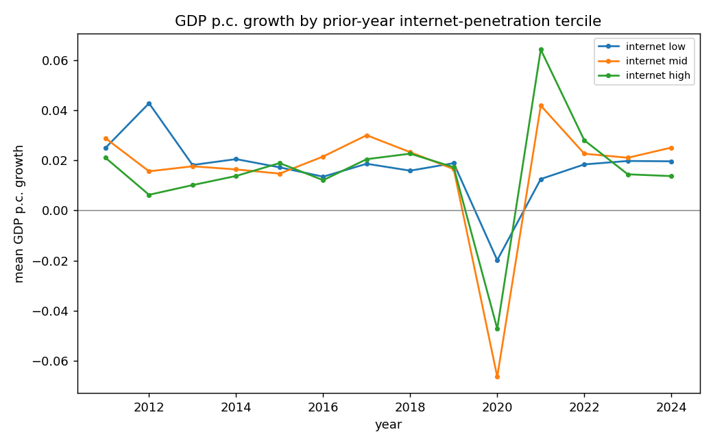
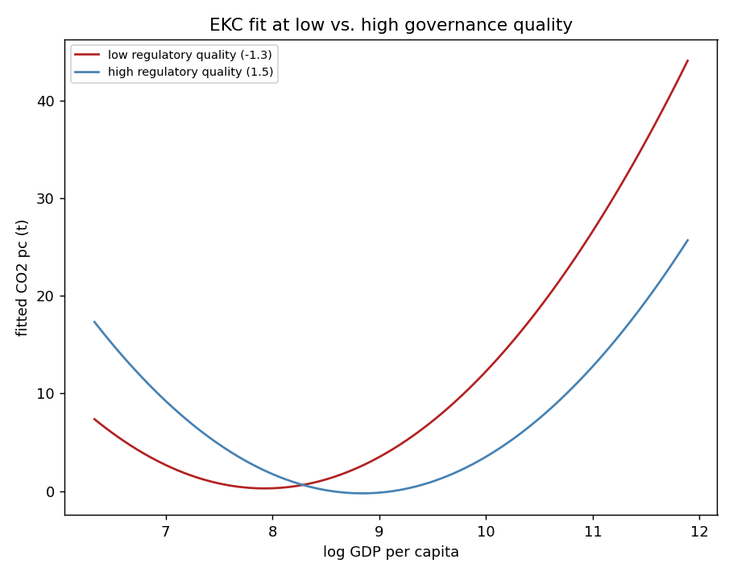
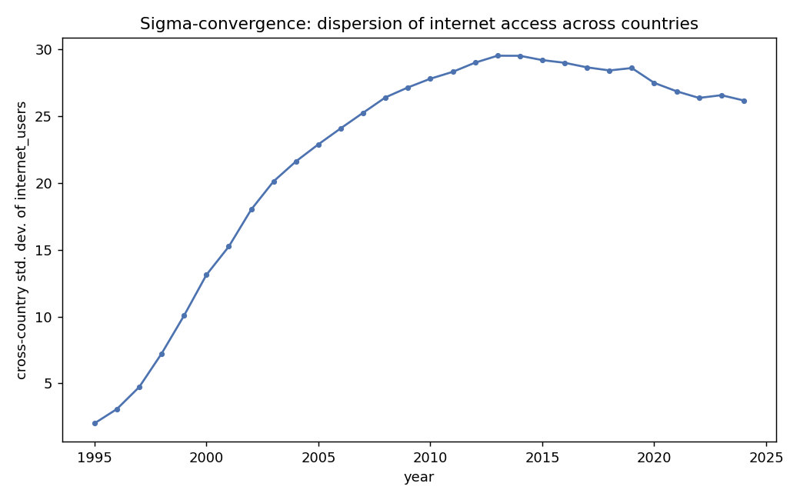

# Topic models — econometric report

All models are observational associations, not causal effects (no instruments used anywhere). See each section's caveat.

## 1. Tech/digital diffusion & subsequent growth

**Question:** does lagged internet penetration predict next-period GDP-per-capita growth (2010-2024), controlling for lagged investment, education, and trade openness? Closest available WDI analog to "does tech/AI adoption pay off" -- no AI-specific data exists in this source.

**Method:** panel FE (entity + year), clustered SE by country.

**Headline:** internet_users(t-1) coefficient = -0.0001 (p=0.459)

|                       |    coef |   std_err |   t_stat |   p_value |
|:----------------------|--------:|----------:|---------:|----------:|
| const                 | -0.0279 |    0.0196 |  -1.4255 |    0.1543 |
| internet_users_lag1   | -0.0001 |    0.0001 |  -0.7408 |    0.4589 |
| gcf_pct_gdp_lag1      |  0.0002 |    0.0005 |   0.4929 |    0.6222 |
| secondary_enroll_lag1 |  0.0001 |    0.0002 |   0.8061 |    0.4203 |
| trade_pct_gdp_lag1    |  0.0004 |    0.0001 |   2.8099 |    0.005  |

**Caveat:** reverse causality is plausible (richer, faster-growing countries also adopt tech faster); the 1-year lag reduces but does not eliminate this.

## 2. Pollution: EKC x governance, and decoupling

**Question:** does regulatory quality shift the GDP-CO2 (Environmental Kuznets Curve) relationship, and is carbon intensity actually falling within countries over time (decoupling), and does the pace differ by income group?

**EKC x governance headline:** log_gdp_pc x regulatory_quality interaction = -1.8701*** (p=0.008)

**Decoupling (within-country carbon-intensity trend, %/year) by income group:**

| income_group        |   trend_coef |   p_value |   pct_change_per_year |   n_obs |
|:--------------------|-------------:|----------:|----------------------:|--------:|
| High income         |      -0.0052 |    0      |               -2.2185 |    1500 |
| Low income          |       0.0007 |    0.1255 |                0.7542 |     622 |
| Lower middle income |      -0.0014 |    0.3144 |               -0.8755 |    1151 |
| Upper middle income |      -0.0059 |    0.0001 |               -2.0034 |    1230 |

**Caveat:** EKC turning points from a quadratic fit are sensitive to outliers (e.g. Gulf petrostates); treat as descriptive.

## 3. Conditional beta-convergence

**Question:** controlling for investment, education, trade openness, and rule of law, do poorer countries still grow faster (conditional convergence, Barro/Mankiw-Romer-Weil style)?

**Headline:** log_gdp_pc(t-1) coefficient = -0.0511*** (p=0.000)

|                       |    coef |   std_err |   t_stat |   p_value |
|:----------------------|--------:|----------:|---------:|----------:|
| const                 |  0.445  |    0.0908 |   4.9003 |    0      |
| log_gdp_pc_lag1       | -0.0511 |    0.0098 |  -5.1987 |    0      |
| gcf_pct_gdp_lag1      |  0.0008 |    0.0003 |   3.0591 |    0.0022 |
| secondary_enroll_lag1 |  0.0004 |    0.0001 |   2.3891 |    0.017  |
| trade_pct_gdp_lag1    |  0.0003 |    0.0001 |   2.3929 |    0.0168 |
| rule_of_law_lag1      | -0.0017 |    0.0054 |  -0.3039 |    0.7612 |

**Caveat:** lagged-level regressor + entity fixed effects in a finite panel is subject to Nickell (1981) dynamic-panel bias; a proper treatment would use Arellano-Bond/GMM, not attempted here.

## 4. Digital divide vs. inequality

**Question:** is internet access lower in more unequal countries, and has the cross-country digital divide been widening or narrowing over time?

**Headline:** gini coefficient on internet_users = -1.0738*** (p=0.000)

**Sigma-convergence:** cross-country std. dev. of internet_users went from 2.0 (1995) to a peak of 29.5 (2013) to 26.2 (2024) -- the divide widened during early diffusion, then has been slowly narrowing.

**Caveat:** purely descriptive/correlational; gini's sparse coverage (never >50% of countries in any single year) means this pools across many years and country-sets.
